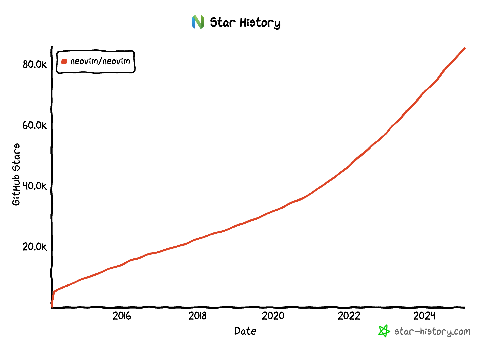
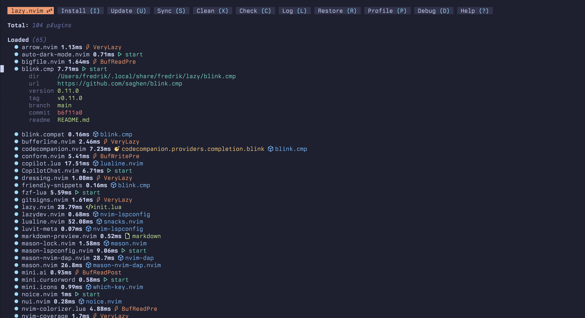
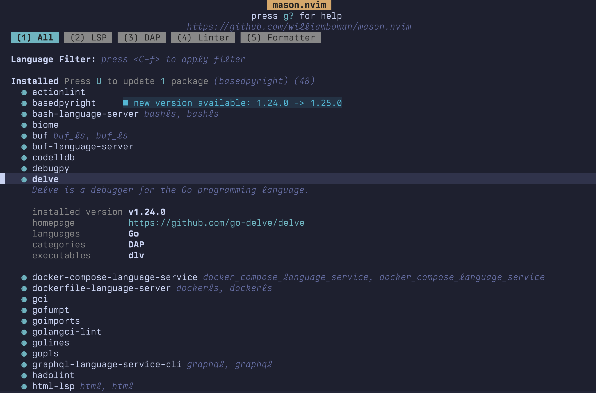
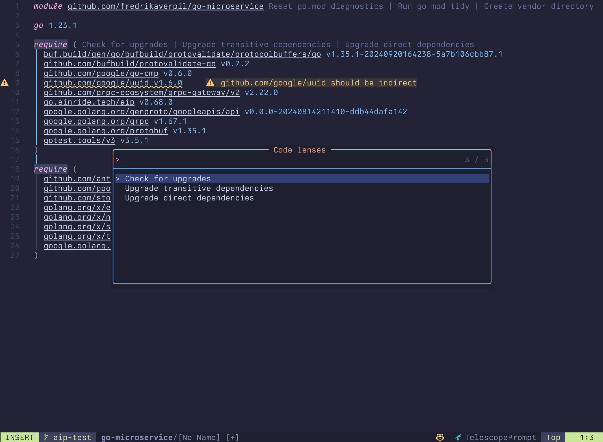
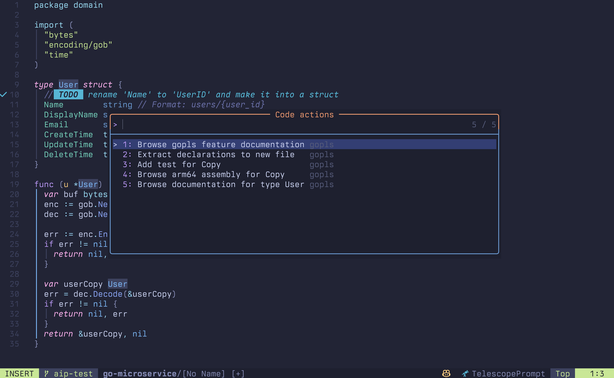
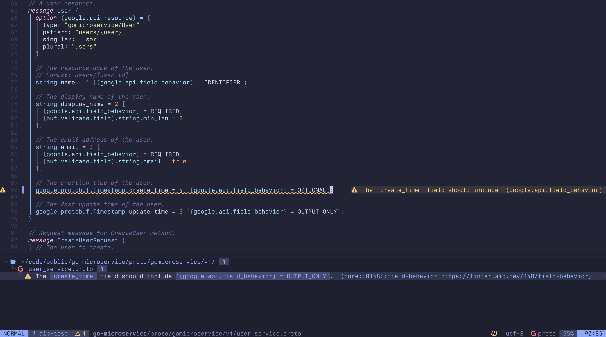
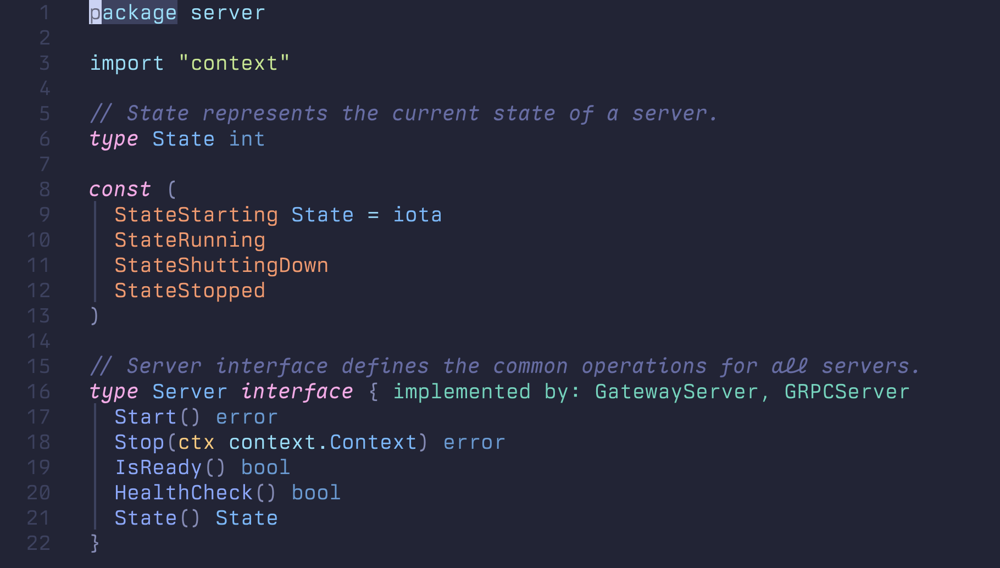

## Agenda topics

<!-- column_layout: [1, 1] -->

<!-- column: 0 -->

### Developing with Go in Neovim

1. Quick intro
1. Managing tools and plugins
1. Setting up the essentials
1. DEMO 😅
1. Conclusion

<!-- column: 1 -->

### Building a new Neotest adapter for Go

1. Why a new adapter?
1. Learning the framework
1. A glimpse into the development process
1. v0.0.1 can ship!
1. Leveraging `go list`
1. Current status and future plans

<!-- reset_layout -->

---

### Q&A

🥤🍿

<!-- end_slide -->

## whoami 🤓

- 1992: Commodore Amiga 600HD, Amos
<!-- pause -->
- 1994: Gateway2000 i486 DX4, Basic

<!-- pause -->

- 1996: IBM Thinkpad, HTML, PHP, Perl, SQL, ASP

<!-- pause -->

- 2001: iMac, Actionscript (ECMAScript 4)

<!-- pause -->

...

- 2025: MacBook Pro, Go, Protobuf, SQL, Python, Lua

<!-- end_slide -->

## Quick intro

### Background

<!-- column_layout: [1, 1] -->

<!-- column: 0 -->



Forked off Vim in 2014.

<!-- column: 1 -->

- High level of collab between maintainers and users.
- Direct access to editor internals and APIs.
- No build system, no compilation, no SDK.
- Mostly Apache 2.0, funded by sponsors and donations.

<!-- pause -->

- Preferably configured in Lua.

```lua
-- a simple lua module

local M = {}

local M.str = "foo"
local M.num = 42
local M.lst = { "foo", "bar" }
local M.tbl = { foo = true }

local function M.foo(bar)
    return bar or nil
end

return M
```

[Neovim.io](https://neovim.io)

<!-- reset_layout -->

<!-- end_slide -->

### Why Neovim?

- Customizable; make it your own.
- So simple to build stuff, it's fun!
- Deeper understanding of underlying tools.
<!-- pause -->
- ⚠️ Warning: Potentially a never-ending hobby project 🫠

<!-- end_slide -->

### Basic options

Neovim is configured using a single `init.lua` file (or more).

```lua
-- display tabs as 4 spaces
vim.opt.tabstop = 4

-- insert 4 spaces when tab is pressed
vim.opt.softtabstop = 4

-- indent << or >> by 4 spaces
vim.opt.shiftwidth = 4

-- expand tab into spaces
vim.opt.expandtab = false
```

Set ad-hoc:

- Re-source the config file `:source %`
- Execute VimScript command: `:set tabstop 4`
- Execute Lua command: `:lua vim.opt.tabstop = 4`

<!-- end_slide -->

### Per-filetype options

Add `~/.config/nvim/after/ftplugin/go.lua` to override:

```lua
-- display tabs as 2 spaces
vim.opt.tabstop = 2

-- insert 2 spaces when tab is pressed
vim.opt.softtabstop = 2

-- indent << or >> by 2 spaces
vim.opt.shiftwidth = 2

-- expand tab into spaces
vim.opt.expandtab = false
```

<!-- end_slide -->

### Using functions

Override on per-filetype basis, for the opened buffer:

```lua
vim.api.nvim_create_autocmd("FileType", {
  pattern = { "go", "gomod", "gowork" },
  callback = function()
    vim.opt.tabstop = 2
    vim.opt.softtabstop = 2
    vim.opt.shiftwidth = 2
    vim.opt.expandtab = false
  end,
})
```

Other ways to customize:

- listening for events.
- writing your own logic.
- per-project overrides / config.

<!-- end_slide -->

## Managing tools and plugins

### Plugin manager: Lazy.nvim

[Lazy.nvim](https://github.com/folke/lazy.nvim), provides lockfile mechanism.

<!-- column_layout: [2, 1] -->

<!-- column: 0 -->



<!-- column: 1 -->

```lua
-- someplugin.lua

return {
  "user/projx",
  opts = { ... },
}

```

<!-- end_slide -->

### Tools management: Mason

<!-- column_layout: [2, 1] -->

<!-- column: 0 -->



<!-- column: 1 -->

- Third-party plugin.
- Unless you prefer Nix 🥸
- Manages tooling and places binaries on `$PATH` (prepend or append).
- Easy to add tools via PR.
- Downloads / builds off GitHub releases.

```lua
{
  "williamboman/mason.nvim",
  opts = {
    ensure_installed = {
      "delve", "gopls", ...
    },
  },
}
```

<!-- reset_layout -->

<!-- end_slide -->

### Mason lockfile

Simple lock-file mechanism via `"zapling/mason-lock.nvim"` (143 LOC ❤️):

```json
{
  "delve": "v1.24.0",
  "gci": "v0.13.5",
  "gofumpt": "v0.7.0",
  "goimports": "v0.29.0",
  "golangci-lint": "v1.63.4",
  "golines": "v0.12.2",
  "gopls": "v0.17.1"
}
```

<!-- end_slide -->

## Setting up the essentials

### Syntax highlighting: Tree-sitter

- Available natively, but not the full installation.
- Syntax highlighting via AST parsing.
- Indentation (e.g. folding).
- Injection of languages into languages.

⚛️ Originally developed for use in the Atom editor, created by the Zed team.

```lua
{
  "nvim-treesitter/nvim-treesitter",
  opts = {
    ensure_installed = { "go", "gomod", "gosum", "gowork" },
    auto_install = true,
    highlight = { enable = true },
  },
}
```

<!-- end_slide -->

### LSP: gopls

✋ Neovim `v0.11.0` syntax!

```lua {22-23|2|3|4|5-13|14-18|19-26|28-29}
local config = {
  cmd = { "gopls" },
  filetypes = { "go", "gomod", "gowork", "gosum", "gotmpl", "gohtml" },
  root_markers = { "go.work", "go.mod", ".git" },
  on_attach = function(client, bufnr)
    if client.supports_method("textDocument/codeLens") then
      vim.lsp.codelens.refresh()
      vim.api.nvim_create_autocmd(
        { "BufEnter", "CursorHold", "InsertLeave" },
        { buffer = bufnr, callback = vim.lsp.codelens.refresh },
      )
    end
  end,
  capabilities = vim.tbl_deep_extend(
    "force",
    vim.lsp.protocol.make_client_capabilities(),
    require("blink.cmp").get_lsp_capabilities(),
  ),
  settings = {
    gopls = {
      -- https://github.com/golang/tools/blob/master/gopls
      buildFlags = { "-tags=wireinject,integration" },
      templateExtensions = { "gotmpl", "gohtml" }
      gofumpt = false,
    },
  },
}
vim.lsp.config["gopls"] = config
vim.lsp.enable("gopls", true)
```

<!-- end_slide -->

### Code lens

- Information of actions presented inline in buffer
- Not to be confused with "code actions" ("quickfix" in vscode)



<!-- end_slide -->

### Code actions

- Not shown inline in the buffer.



<!-- end_slide -->

### Completion and snippets

Native completion exists but modern plugins provide more features.

```lua
{
  "saghen/blink.cmp",
  dependencies = "rafamadriz/friendly-snippets",
  version = "*",
  opts = {},
  opts_extend = { "sources.default" }
}
```

<!-- pause -->

Native snippets support (`go.json` file):

```json
{
  "if err != nil return": {
    "prefix": "ir",
    "body": "if err != nil {\n\treturn ${1:nil}, ${2:err}\n}",
    "description": "Snippet for if err != nil with return"
  }
}
```

<!-- end_slide -->

### Formatting: conform.nvim

- Can be invoked by LSP-provided formatting.
- Greater control can be achieved using a plugin.

```lua
{
  "stevearc/conform.nvim",
  opts = {

    formatters_by_ft = {
      go = { "goimports", "gci", "gofumpt", "golines" },
    },

    formatters = {
      golines = {
        prepend_args = {
          "--base-formatter=gofumpt",
          "--ignore-generated",
          "--tab-len=1",
          "--max-len=120",
        },
      },
    },
  },
}
```

<!-- end_slide -->

### Linting: nvim-lint

- Underlying system is called "diagnostics".
- Provides infra for displaying warnings, errors, hints.
- Receives diagnostics from LSP, tools/plugins, your custom code.

```lua
{
  "mfussenegger/nvim-lint",
  opts = {
    linters_by_ft = {
      go = { "golangcilint" },
    },
    linters = {
      golangcilint = { args = golangcilint_args() },
    },
  },
}
```

<!-- end_slide -->

### Linting: custom linter

Linter for `*.proto` files, leveraging `buf` and Google's `api-linter`.



<!-- end_slide -->

### Combine languages

When working with the `text/template` and `html/template` packages.

- Enable in `gopls` settings: `{ templateExtensions = { "gotmpl", "gohtml" } }`
  - Template variable completion
  - Diagnostics for syntax errors
  - Hover information for template functions

<!-- pause -->

- Inject HTML syntax highlighting with tree-sitter
- HTML formatting and linting.

<!-- pause -->

When working with Go and SQL:

- Inject HTML syntax highlighting with tree-sitter

<!-- pause -->

🤔 Combine LSPs ...?

- You can chain filetypes, e.g. `:set filetype=html.gohtml`

<!-- end_slide -->

### Testing: neotest

- Largest testing framework for Neovim.
- Written in Lua.
- The usual folder/file/test tree representation.
- Adapters available for ~30 languages and test runners, including Go.

```lua
{
  "nvim-neotest/neotest",
  dependencies = {
    "nvim-lua/plenary.nvim",
    "antoinemadec/FixCursorHold.nvim",
    "nvim-treesitter/nvim-treesitter",
    "fredrikaverpil/neotest-golang",
  },
  config = function()
    require("neotest").setup({
      adapters = {
        require("neotest-golang")()
      }
    })
  end
}
```

<!-- end_slide -->

### Debugging: nvim-dap, nvim-dap-ui

- Launch an application to debug.
- Attach to running applications and debug them.
- Set breakpoints and step through code.
- Inspect the state of the application.

```lua
{
  "mfussenegger/nvim-dap",
  dependencies = {
    "leoluz/nvim-dap-go",
  },
  opts = {
    dap_configurations = {
      {
        type = "go",
        name = "Debug opened file's cmd/cli",
        request = "launch",
        cwd = "${fileDirname}",
        program = "./${relativeFileDirname}",
        args = {},
      },
    },
  },
},

{ "rcarriga/nvim-dap-ui" },
```

<!-- end_slide -->

### Extra: Goplements

`maxandron/goplmements` visualizes Go struct and interface implementations (282
LOC ❤️).

- Tree-sitter is used to find all structs and interfaces in the current buffer.
- The LSP client (gopls) is used to find implementations of structs and
  interfaces.

---



<!-- end_slide -->

## Demo

<!-- column_layout: [1, 2] -->

<!-- column: 0 -->


<!-- column: 1 -->

- Code actions
- Completion
- Diagnostics
- Testing
- Debugging

<!-- reset_layout -->

<!-- end_slide -->

## Conclusion

### The good

- You make it your own. Muscle memory.
- Rinse and repeat mentality on setting up new languages and tooling.
- Friendly, encouraging and passionate community.
- Lua is very fast and super simple; easy to prototype up ideas.
- Great experience writing Go.

<!-- pause -->

### The bad

- Some commercial tools might be better at supplying ergonomics/convenience in
  some areas (e.g. GoLand).
- Requires a lot of time to configure until it's "stable".

<!-- pause -->

---

Check out my [dotfiles](https://github.com/fredrikaverpil/dotfiles) for my
Neovim setup!

<!-- end_slide -->

## Building a new Neotest adapter for Go

I just used it in the demo; `github.com/fredrikaverpil/neotest-golang`

<!-- pause -->

### Why a new adapter?

- I stumbled upon many bugs and issues
- Invested in Neovim, "fix it yourself" mentality

<!-- pause -->

### Learning the framework

An interface, describing methods that must be implemented in Lua.

<!-- pause -->

- Detect tests (tree-sitter)
<!-- pause -->
- Generate test command
<!-- pause -->
- Parse test execution output
<!-- pause -->
- Populate filetree with status/output
<!-- pause -->
- Populate inline diagnostics into the buffer (file)

<!-- pause -->

Fair enough, sounds pretty simple, huh?

<!-- end_slide -->

## A glimpse into the development process

### Detect tests

Tree-sitter query to detect test function and sub-test function.

```ts
[[
    ; query for test function
    ((function_declaration
      name: (identifier) @test.name)
        (#match? @test.name "^(Test|Example)")
        (#not-match? @test.name "^TestMain$"))
        @test.definition

    ; query for subtest, like t.Run()
    (call_expression
      function: (selector_expression
        operand: (identifier) @test.operand (#match? @test.operand "^[t]$")
        field: (field_identifier) @test.method) (#match? @test.method "^Run$")
      arguments: (argument_list . (interpreted_string_literal) @test.name))
      @test.definition
]]
```

Neotest will execute this on the codebase and build a tree of folders, files and
tests.

<!-- end_slide -->

### Generate test command

But `go test` doesn't use filepaths, it uses Go import paths. 🤔 Can it be
solved later?

```bash
go test gowest/internal/foo
```

```bash
go test gowest/internal/...
```

```bash
go test ./...
```

```bash
go test gowest/internal/foo -run "^(^TestFoo$|^TestBar$)$"
```

An individual test can be executed "naively" 🤞 but might do excessive
compilation:

```bash
go test ./... -run <regexp>
```

<!-- end_slide -->

### Executing an individual test

```bash +exec
cat gowest/internal/foo/bar_test.go
```

<!-- pause -->

- Change `$CWD` to the parent folder of the test file.
- Run `go test ./... -run <regexp>`

```bash +exec
cd gowest/internal/foo
go test ./... -run "^TestAdd$"
```

<!-- end_slide -->

Let's add the `-json` flag.

```bash +exec
cd gowest/internal/foo
go test -json ./... -run "^TestAdd$"
```

<!-- pause -->

The `PASS` status and other output can be extracted! 👍

<!-- end_slide -->

The `FAIL` status can also be detected.

```bash +exec
cd gowest/internal/foo
go test -json ./... -run "^TestAddFail$"
```

<!-- end_slide -->

## v0.0.1 can ship! 🚀

- Treesitter query detects tests and populates tree.
- Test command is generated for each tree position (each test).
- Execution status and output is parsed and populated onto the tree positions.

### Good

- Technically, the adapter can run any test in most projects.
- Very simple and robust implementation.
- Already solving most issues I had with the already existing adapter.

#### Room for improvement

- No optimization, very slow and resource-heavy when running e.g. all tests in a
  project.
- Does not cater for build tags, debugging etc...

##### Next step

- Optimizations; run all files in folder/file using one `go test` command.

<!-- end_slide -->

## Leveraging `go list`

### Executing all tests in a folder/file

Somehow, need to translate from filepath to package import path. 🤔

<!-- pause -->

### Translate with `go list`

The `go list` can provide information about an import path.

```bash +exec
tree gowest
```

<!-- pause -->

```bash +exec
cd gowest
go list ./...
```

<!-- end_slide -->

Let's add the `-json` flag.

```bash +exec
cd gowest
go list -json ./... |  jq -c '{Dir, ImportPath, TestGoFiles}'
```

<!-- pause -->

<!-- end_slide -->

## Current status and future plans

### Has been implemented

- Custom arguments support
- Coverage support
- DAP support
- Monorepo support
- Sub-package detection with empty/non-existing parent package
- XTestGoFiles - value accessed under other key in `go list` output
- Testify support 🙈
- Windows support (always problems on Windows)
- Non-UTF8 sanitization

### Potentially future features

- Runtime detection of test
- Devcontainers
- Benchmarks

<!-- end_slide -->

### Thank you ❤️ (questions?)

That's all folks! 😄

- Blog: `fredrikaverpil.github.io`
- Neotest-golang: `github.com/fredrikaverpil/neotest-golang`
